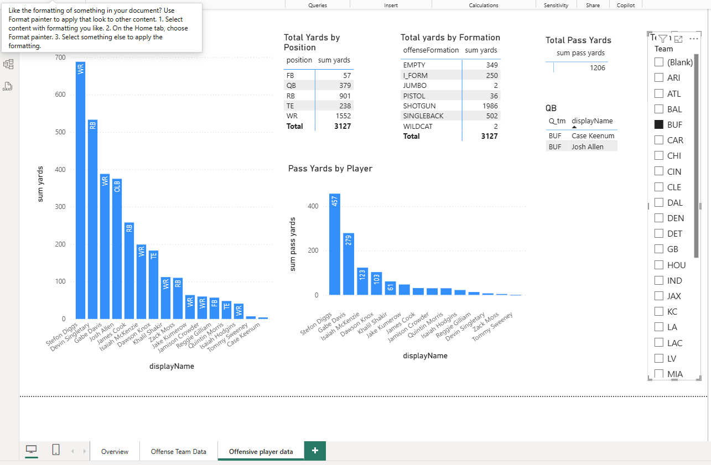

# 2022_NFL_Analytics

## Business Goal
This project will analyze 2022 NFL Data in order to extract insights on team and player performance.

## Data Source

Data is taken from Kaggle NFL data analytics competition. Only the first 9 weeks of seasonal data is provided.

Dimension tables include:
   Games.csv [gameId, season, week, gameDate, gameTime, visitorTeam, homeTeam, homeFinalScore, visitorFinalScore]
   Players.csv [nflId, height, weight, birthDate, collegeName, position, displayName]

Fact tables include:
   Plays.csv [playId,	ballCarrierId,	ballCarrierDisplayName,	playDescription,	quarter,	down	,yardsToGo	,possessionTeam,	defensiveTeam	yardlineSide,	yardlineNumber,	gameClock,	preSnapHomeScore,	preSnapVisitorScore,	passResult,	passLength,	penaltyYards	prePenaltyPlayResult,	playResult,	playNullifiedByPenalty	,absoluteYardlineNumber	,offenseFormation,	defendersInTheBox	,passProbability	,preSnapHomeTeamWinProbability,	preSnapVisitorTeamWinProbability,	homeTeamWinProbabilityAdded	,visitorTeamWinProbilityAdded	,expectedPoints,	expectedPointsAdded	,foulName1	,foulName2,	foulNFLId1	,foulNFLId2]

   Tackles.csv [gameId, playId,nflId, tackle, assist, forcedFumble,pff_missedTackle ]

## Tools Used
   All work will be in Python for cleaning of tables and PowerBI for analysis.

## Workflow and Logic
   
#### Clean and create tables
   Cleaning csv files includes Games_cleaning.py  ->  remove unnecessary columns while adding new columns of home_winner (bool), Id of game winner and Id of loser for summary later. 

   Cleaning players.csv is done in Players_cleaning.py -> remove unnecessary columns

   Cleaning plays.csv done in Plays_cleaning.py -> Remove unnecessary columns  

   Create new tables in PowerBi using DAX 

#### Import and Set up a Data Model in PowerBi

## Results

Extract Teams Win Loss data in PowerBI  with slicers for each team and each week (Overview)

Here you can see the wins by Atlanta, their opponent, and the weeks of wins --- todo- add score

Extract team data by yards gained per game against opponent for each team, slicer by team and by quarter of game(Offense Team Data) ---todo - add score and win or loss to each bar

   
Extract Offensive Player data with slicers by team. 

Here is the sliced offensive data for Buffalo  

   
## Suggested Business Actions

This dashboard was created as a tool for quick insights for anyone interested in NFL analytics.  It is meant to be used to compare seasonal data across multiple seasons with similar dashboards.  While it is possible to use the dashboard slicers to derive information for each team and compare them.  Possible business actions could include

<ul>
<li>Trading the least performing players on offense.</li>
<li>Examining the performance of certain players in different offensive formations.</li>
<li>Determining the pattern of performance in home games vs away games.</li>
</ul>
